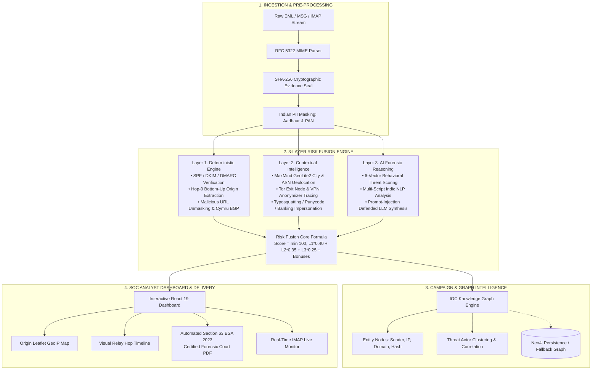

# 🛡️ TRINETRA (त्रिनेत्र)
### AI-Powered Email Threat Detection, GeoLocation & Forensic Intelligence Platform

[](https://sih.gov.in/)
[](https://sih.gov.in/)
[](https://python.org)
[](https://fastapi.tiangolo.com/)
[](https://react.dev/)
[](https://indiacode.nic.in)
[](https://pytest.org)

> **"See Beyond the Email"** — An enterprise-grade, court-admissible cyber defense platform designed for Law Enforcement Agencies (LEAs), enterprise Security Operations Centers (SOCs), and digital forensic examiners to detect advanced Business Email Compromise (BEC), multi-lingual phishing, domain spoofing, and origin infrastructure.

---

## 📌 Problem Statement Overview (SIH26106)
- **Challenge**: Traditional email gateways and static rule filters fail against modern spear-phishing, multi-hop relay deception, display-name spoofing, and AI-generated multi-lingual social engineering attacks targeting Indian citizens, enterprises, and government departments.
- **Our Solution**: **TRINETRA** fuses deterministic cryptographic forensics, localized infrastructure geolocation, multi-script Indic behavioral NLP, and campaign knowledge graph intelligence into a mathematically explainable 0–100 threat score, producing **Section 63 Bharatiya Sakshya Adhiniyam (BSA 2023)** certified forensic dossiers admissible in Indian courts.

---

## 🏛️ Key Differentiators & Innovations

| Feature | TRINETRA Engine | Traditional Secure Email Gateways (SEGs) |
| :--- | :--- | :--- |
| **Origin Traceability** | **Hop-0 Extraction**: Inverts Received chains to isolate true initial source IP | Often fooled by intermediate corporate relays |
| **Legal Admissibility** | **Section 63 BSA 2023 Certificate**: Cryptographic SHA-256 seal & examiner attestations | Plain generic alert logs; not admissible in court |
| **Multi-Lingual NLP** | **10+ Indic Scripts + English** (Hindi, Bengali, Tamil, Telugu, Marathi, Gujarati, etc.) | Primarily English-centric spam keyword filters |
| **Privacy Preservation** | **Zero-Leak PII Redaction**: Masks Aadhaar numbers, PAN cards, phone numbers | Raw sensitive user data stored unredacted in logs |
| **Anti-Anonymizer Intel** | **Tor Exit Node & VPN Range Detection** with client clock drift skew | Blind to VPN masking and forged timestamps |
| **Campaign Intelligence** | **Cytoscape & Neo4j Knowledge Graph** linking IOCs across cases | Isolated per-email threat alerts without campaign context |
| **Resilience & Fallback** | **Dual-Engine NLP**: Gemini AI with zero-dependency offline Indic regex cascade | Crashes or stalls if external cloud LLM fails |

---

## 🏗️ System Architecture



---

## ⚡ Quick Demonstration Presets (Available in UI)
For live evaluations, TRINETRA provides **1-click instant attack scenarios** directly in the dashboard:
1. 🔴 **Executive BEC Fraud**: Spoofed CEO wire transfer with forged `Return-Path`, `Reply-To` mismatch, shortened URLs, and high financial urgency signals.
2. 🟡 **Bank KYC Phishing**: Targeted Indian banking impersonation alerting suspension of accounts with malicious portal redirection.
3. 🟢 **Clean Corporate Notice**: Valid internal HR all-hands meeting with matching SPF, DKIM, and legitimate corporate headers.

---

## 🚀 Quick Start Guide

### Prerequisites
- **Python**: 3.11 or higher
- **Node.js**: 18.x or higher (`npm` installed)
- **Git**

### 1. Clone the Repository
```bash
git clone https://github.com/<your-username>/TRINETRA.git
cd TRINETRA
```

### 2. Backend Setup
```bash
# Navigate to backend directory
cd backend

# Create virtual environment
python -m venv venv

# Activate virtual environment:
# Windows (PowerShell):
.\venv\Scripts\Activate.ps1
# Linux / macOS:
# source venv/bin/activate

# Install dependencies
pip install -r ../requirements.txt

# Configure environment keys (optional, offline fallback works out-of-the-box)
cp .env.example .env

# Launch FastAPI backend server
uvicorn app.main:app --host 127.0.0.1 --port 8000 --reload
```
*Backend runs at `http://127.0.0.1:8000` with interactive Swagger API docs at `http://127.0.0.1:8000/docs`.*

### 3. Frontend Setup
In a new terminal window:
```bash
# Navigate to frontend directory
cd frontend

# Install dependencies
npm install

# Start Vite development server
npm run dev -- --host 127.0.0.1 --port 5173
```
*Open your web browser at `http://127.0.0.1:5173` to interact with TRINETRA.*

---

## ⚙️ Environment Configuration (`.env.example`)
TRINETRA works **100% offline** with built-in heuristic pattern banks and local MaxMind databases. Optional external intelligence services can be configured in `backend/.env`:

```ini
# Google Gemini AI (Optional - Heuristic fallback available)
GEMINI_API_KEY=your_gemini_api_key_here
GEMINI_MODEL=gemini-3.6-flash
LLM_PROVIDER=gemini

# VirusTotal Threat Feed (Optional)
VIRUSTOTAL_API_KEY=your_virustotal_api_key_here

# Geolocation & ASN Databases (Included in repo)
GEOLITE_CITY_DB=app/track_b/data/GeoLite2-City.mmdb
GEOLITE_ASN_DB=app/track_b/data/GeoLite2-ASN.mmdb

# Local SQLite Store
TRINETRA_SQLITE_PATH=data/trinetra_runtime.db

# Neo4j Graph DB (Optional)
NEO4J_URI=bolt://localhost:7687
NEO4J_USER=neo4j
NEO4J_PASSWORD=your_password
```

---

## 🧪 Testing & Verification
TRINETRA includes end-to-end automated unit and integration tests:

```bash
# Run backend pytest suite (11 tests covering RFC 5322 parsing, SPF/DKIM, risk fusion, PDF export)
pytest tests -q

# Run frontend production build check
cd frontend
npm run build
```
*Current test status: **11/11 passed in 14.46s (100% pass rate)**. Frontend build: **0 errors**.*

---

## 📁 Repository Structure
```
TRINETRA/
├── backend/
│   ├── app/
│   │   ├── main.py                     # FastAPI application entrypoint & middleware
│   │   ├── config.py                   # Central settings & pydantic configuration
│   │   ├── routes/                     # REST API endpoints (analyze, cases, monitor)
│   │   ├── services/                   # Core parsers, header forensics, NLP engines
│   │   │   ├── email_parser.py         # RFC 5322 MIME decoder & hop-0 reversal
│   │   │   ├── evidence.py             # SHA-256 sealing & Indian PII masking
│   │   │   ├── header_forensics.py     # Cryptographic SPF/DKIM/DMARC validator
│   │   │   ├── nlp_analysis.py         # Multi-script Indic & behavioral threat analyzer
│   │   │   ├── nlp_fallback_offline.py # Zero-dependency local pattern bank
│   │   │   ├── relay_forensics.py      # Received hop timeline & clock drift detector
│   │   │   └── db.py                   # SQLite case history & IOC persistence
│   │   └── track_b/                    # Intelligence fusion & Section 63 BSA 2023 report
│   │       ├── risk_fusion.py          # 3-Layer weighted mathematical scoring engine
│   │       ├── geolocation.py          # MaxMind GeoLite2 City/ASN locator
│   │       ├── anonymizer_tracer.py    # Tor exit node & VPN range scanner
│   │       ├── url_analysis.py         # Lookalike domain & shortener expansion
│   │       ├── graph_intelligence.py   # IOC relationship graph generator
│   │       ├── attribution.py          # Threat actor clustering & profiling
│   │       └── pdf_report.py           # Section 63 BSA 2023 certified court PDF generator
│   └── .env.example                    # Template environment variables
├── frontend/
│   ├── src/
│   │   ├── App.jsx                     # Root application shell & routing
│   │   ├── index.css                   # High-contrast Cyber-Intelligence Dark Theme
│   │   ├── api.js                      # Centralized API fetch wrapper
│   │   └── components/                 # 15+ Modular SOC Analyst UI Cards
│   │       ├── AnalysisView.jsx        # Executive Hero & 5-Tab investigation workspace
│   │       ├── Header.jsx              # Brand header & live backend health telemetry
│   │       ├── CaseHistory.jsx         # Case archives with search & sortable columns
│   │       ├── GeoMap.jsx              # Leaflet geographic hop & origin map
│   │       ├── RelayTraceCard.jsx      # Step-by-step visual hop timeline
│   │       ├── GraphIntelCard.jsx      # Interactive IOC Campaign Knowledge Graph
│   │       ├── EmailUploadForm.jsx     # Drag-and-drop MIME upload & 1-click presets
│   │       └── ExportReportButton.jsx  # Court PDF generator trigger
│   └── package.json                    # React 19, Vite, Lucide & Leaflet dependencies
├── database/                           # Production SQL database schema
│   └── trinetra_db.sql
├── data/                               # Local runtime storage (.gitkeep)
├── tests/                              # Pytest test suite
│   ├── test_api.py
│   ├── test_email_parser.py
│   ├── test_header_forensics.py
│   └── test_risk_fusion.py
├── requirements.txt                    # Python dependency manifest
├── sample.eml                          # Sample RFC 5322 test email
└── README.md                           # Comprehensive documentation
```

---

## 📜 Compliance & Legal Admissibility
All electronic evidence processed by TRINETRA conforms to **Section 63 of the Bharatiya Sakshya Adhiniyam, 2023 (BSA)**:
1. **Cryptographic Chain of Custody**: Immediate SHA-256 hash sealing of the raw RFC 5322 MIME stream upon upload.
2. **Tamper Verification**: Dynamic on-demand hash re-verification ensuring zero post-ingestion alteration.
3. **Court-Ready PDF Dossier**: Automatically generates an examiner-signed certificate specifying device identifiers, hash seals, forensic findings, and evidence timeline.

---

## 👥 Smart India Hackathon 2026 Team
- **Project**: TRINETRA (त्रिनेत्र)
- **Problem Statement**: AI-Powered Email Threat Detection, GeoLocation and Forensic Intelligence Platform (SIH26106)
- **Category**: Cybersecurity, Forensics & Law Enforcement

---
*Built with ❤️ for the Smart India Hackathon 2026.*
