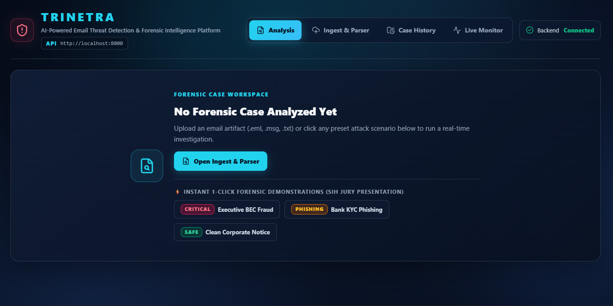

# 🛡️ TRINETRA (त्रिनेत्र) — SIH 2026 Comprehensive Technical Project & Prototype Report

[](https://sih.gov.in/)
[](https://sih.gov.in/)
[](https://sih.gov.in/)
[](https://indiacode.nic.in)
[](https://pytest.org)

> **Official Project Report & Technical Documentation**  
> **Problem Statement ID**: SIH26106  
> **Title**: AI-Powered Email Threat Detection, GeoLocation and Forensic Intelligence Platform  
> **Theme / Category**: Blockchain & Cybersecurity / Digital Forensics & Law Enforcement  
> **Direct Downloads**: [📄 Download Official PDF Report](TRINETRA_SIH26106_Project_Report.pdf) | [📝 Download Word Document](TRINETRA_SIH26106_Project_Report.docx) | [🌐 GitHub Repository](https://github.com/prit-om/TRINETRA-SIH26106)

---

## 👥 Smart India Hackathon 2026 — Team Coordination Zero

| Role | Name | GitHub | Department | Year | University Roll No. |
| :--- | :--- | :---: | :--- | :---: | :---: |
| 👑 **Team Leader** | **Pritam Maity** | [@prit-om](https://github.com/prit-om) | Computer Science & Engineering (CSE) | 3rd Year | `27800124062` |
| 🛡️ **Member** | **Sneha Kumari Mahato** | [@TheShadowRoot](https://github.com/TheShadowRoot) | CSE (AI & ML) | 3rd Year | `27830824047` |
| 🛡️ **Member** | **Barsa Sen** | [@BarsaBytes](https://github.com/BarsaBytes) | Computer Science & Engineering (CSE) | 3rd Year | `27800124093` |
| 🛡️ **Member** | **Pabitra Ghosh** | — | CSE (AI & ML) | 3rd Year | `27830824042` |
| 🛡️ **Member** | **Pavel Jana** | — | Computer Science & Engineering (CSE) | 3rd Year | `27800124021` |
| 🛡️ **Member** | **Lisa Kamle** | — | CSE (AI & ML) | 2nd Year | `27830825004` |

---

## 1. Executive Summary

Email remains one of the most critical communication backbones in government administration, critical national infrastructure (CNI), banking, education, and corporate enterprise. However, it also serves as the primary attack vector for advanced spear-phishing, Business Email Compromise (BEC), CEO fraud, payment diversion, and multi-lingual social engineering.

Conventional Secure Email Gateways (SEGs) and spam filters rely predominantly on static blocklists, signature matching, and generic Bayesian filters. When sophisticated threat actors deploy AI-generated multi-lingual deception, display-name spoofing, forged `Received:` headers, and multi-hop relay chains, traditional defensive filters fail silently. More critically, when an attack succeeds, security teams lack the investigative forensic tools to reconstruct the origin transmission path, estimate the geographical source, and package court-admissible evidence.

**TRINETRA (त्रिनेत्र)** bridges this investigative void. It is an AI-powered email threat detection, geolocation, and forensic intelligence platform engineered to:
1. Parse and cryptographically seal raw RFC 5322 MIME messages at microsecond ingestion.
2. Invert SMTP relay chains via **Hop-0 bottom-up extraction** to isolate the true originating IP address.
3. Quantify risk via a deterministic **3-Layer Mathematical Fusion Engine** (0–100 Threat Score).
4. Analyze multi-lingual Indic content across 10+ Indian regional scripts using local fallback heuristics and LLMs.
5. Unmask lookalike domains, punycode attacks, URL shorteners, and Tor/VPN anonymizers.
6. Correlate indicators of compromise (IOCs) across past incidents via an interactive Knowledge Graph.
7. Automatically synthesize certified forensic dossiers compliant with **Section 63 of the Bharatiya Sakshya Adhiniyam, 2023 (BSA)**.

---

## 2. SIH26106 Problem Context & Objectives

The official Smart India Hackathon problem statement (**SIH26106**) mandates the development of an integrated solution addressing six core capability clusters:

```
[Raw RFC 5322 Email Stream]
          │
          ▼
┌─────────────────────────────────────────────────────────────┐
│ 1. Ingestion & Cryptographic Evidence Sealing (SHA-256)      │
└─────────────────────────────┬───────────────────────────────┘
                              ▼
┌─────────────────────────────────────────────────────────────┐
│ 2. Deep Protocol Forensics (SPF, DKIM, DMARC, Hop-0 Origin) │
└─────────────────────────────┬───────────────────────────────┘
                              ▼
┌─────────────────────────────────────────────────────────────┐
│ 3. Contextual & Network Intelligence (GeoIP, ASN, Anonymizer)│
└─────────────────────────────┬───────────────────────────────┘
                              ▼
┌─────────────────────────────────────────────────────────────┐
│ 4. Multi-Script Indic NLP & Behavioral Threat Reasoning     │
└─────────────────────────────┬───────────────────────────────┘
                              ▼
┌─────────────────────────────────────────────────────────────┐
│ 5. Campaign Graph Intelligence & Threat Actor Clustering    │
└─────────────────────────────┬───────────────────────────────┘
                              ▼
┌─────────────────────────────────────────────────────────────┐
│ 6. Section 63 BSA 2023 Certified Legal PDF Dossier Export   │
└─────────────────────────────────────────────────────────────┘
```

---

## 3. Academic Research Basis & Gap Analysis

Our architecture is informed by empirical research in cybersecurity, natural language processing, and digital forensics:

1. **Business Email Compromise (BEC) Detection**:
   A 2023 systematic literature review (*Atlam & Oluwatimilehin, Electronics 2023*) analyzed 38 studies out of 950 initial candidates, observing that pure body-text spam filters achieve substandard precision against BEC because attackers avoid traditional spam keywords. Reliable detection requires **fusing header authentication with behavioral intent cues**.

2. **Passive IP Geolocation in Threat Attribution**:
   Research by *Mansoori & Welch (Computers & Security, 2020)* on malicious web infrastructure highlights that while database-driven passive IP geolocation (e.g., MaxMind GeoLite2) is instantaneous and non-intrusive, accuracy varies between country-level (95%+) and city-level (50–80%). TRINETRA accounts for this by assigning a **calibrated confidence score** rather than claiming absolute positional certainty.

3. **Email Forensic Timeline Analysis**:
   Recent forensic methodologies (*IEEE Xplore, 2024*) emphasize that timestamp clock skew between successive SMTP hops serves as a high-fidelity indicator of artificial header injection or relay tampering.

---

## 4. End-to-End System Architecture

TRINETRA employs a decoupled, modular 4-tier architecture engineered for high forensic fidelity and offline operational resilience:


### Tier 1: Input & Ingestion Layer
- **Raw File Ingestion**: Accepts `.eml` (RFC 822/5322), `.msg` (Outlook OLE binary), `.txt` raw ASCII headers, and direct MIME streams.
- **Live Mailbox Monitor (IMAP)**: Automated background polling of enterprise mailboxes with automated triage.
- **Cryptographic Evidence Sealing**: Immediate SHA-256 byte-stream hashing preserving the chain of custody before parsing.
- **Zero-Leak PII Redaction**: Regex-based masking of sensitive Indian personal data (12-digit Aadhaar, PAN card, mobile numbers) ensuring **Digital Personal Data Protection Act, 2023 (DPDP)** compliance.

### Tier 2: TRINETRA Forensic Analysis Engine
1. **Header & Protocol Forensics**:
   - SPF (Sender Policy Framework) validation against sender DNS records.
   - DKIM (DomainKeys Identified Mail) cryptographic signature verification.
   - DMARC (Domain-based Message Authentication) alignment checks.
   - Forged header detection: `Return-Path` vs. `From` vs. `Reply-To` cross-examination.
2. **Hop-0 Origin Extraction**:
   - Inverts the RFC 5322 `Received:` header chain from bottom-to-top.
   - Skips internal corporate relays, private RFC 1918 ranges (`10.0.0.0/8`, `172.16.0.0/12`, `192.168.0.0/16`), and loopbacks (`127.0.0.1`) to reliably pinpoint the earliest external sender IP.
3. **Local Geolocation & Network Intelligence**:
   - Bundled **MaxMind GeoLite2 City & ASN** offline binary databases.
   - Cymru BGP transit ASN resolution and Autonomous System profiling.
   - Tor Exit Node and public commercial VPN IP range cross-referencing.
4. **Multi-Script Indic NLP & Behavioral Reasoning**:
   - Dual-engine architecture: Cloud LLM (Gemini 2.5 Flash with strict prompt-injection defense) + **Zero-dependency local Indic regex heuristic cascade**.
   - Evaluates 6 core threat vectors: Executive Impersonation, Financial Urgency, Credential Harvesting, Account Suspension Threats, Social Engineering, and AI-Generated text likelihood.
5. **URL & Attachment Triage**:
   - Unmasks shortened URLs (`bit.ly`, `tinyurl`) via HTTP redirect chain traversal.
   - Detects homograph typosquatting and Punycode (`xn--`) domain spoofing.
   - VirusTotal API integration for known malicious URL and attachment SHA-256 hashes.

### Tier 3: Secure Persistence & Data Layer
- **Relational Storage**: SQLite zero-setup database with migration support to enterprise PostgreSQL.
- **Campaign Graph Engine**: Cytoscape.js visual graph with optional Neo4j graph database backend for cross-case entity correlation (`Sender` $\leftrightarrow$ `IP` $\leftrightarrow$ `Domain` $\leftrightarrow$ `Hash`).

### Tier 4: Delivery & Analyst Workspace
- React 19 + Vite SOC Investigation Dashboard with Dark Cyber-Forensic theme.
- Interactive Leaflet geographic hop & origin map.
- Automated Section 63 BSA 2023 court-admissible PDF dossier generator (ReportLab).

---

## 5. Mathematical Risk Fusion Formula

TRINETRA avoids black-box decisions by implementing an explainable, weighted multi-layer scoring formula bounded between $0$ and $100$:

$$\text{Final Threat Score} = \min\left(100, \; w_1 L_1 + w_2 L_2 + w_3 L_3 + \text{Bonuses}\right)$$

Where:
- **Layer 1 ($L_1$, Weight = 0.40)**: Deterministic Forensics (SPF/DKIM/DMARC failures, `Return-Path` mismatch, `Reply-To` anomaly, header clock skew).
- **Layer 2 ($L_2$, Weight = 0.35)**: Contextual & Infrastructure Intelligence (Malicious URL hits, Tor exit node, VPN range, typosquatting, high-risk ASN).
- **Layer 3 ($L_3$, Weight = 0.25)**: Behavioral & AI Forensic Reasoning (Urgency, wire transfer demand, credential theft, executive impersonation cues).
- **Bonuses**: Executable/macro-enabled attachments (+15), high-confidence threat feed hits (+20).

### Classification Thresholds
- **0 – 24**: 🟢 **SAFE / CLEAN** (Legitimate internal or authenticated correspondence)
- **25 – 49**: 🟡 **LOW RISK / INFORMATIONAL** (Minor header anomaly or unauthenticated benign relay)
- **50 – 74**: 🟠 **SUSPICIOUS** (Probable spoofing, unaligned sender, or social engineering cues)
- **75 – 100**: 🔴 **CRITICAL THREAT / PHISHING / BEC** (Malicious payload, severe impersonation, or confirmed threat actor infrastructure)

---

## 6. Section 63 Bharatiya Sakshya Adhiniyam (BSA 2023) Compliance

On July 1, 2024, the **Bharatiya Sakshya Adhiniyam, 2023 (BSA)** officially repealed and replaced the Indian Evidence Act, 1872. Section 63 of the BSA sets forth the statutory conditions under which electronic records are admissible in Indian courts (succeeding legacy Section 65B).

TRINETRA generates a legally structured **Forensic Technical Examination Report** incorporating:
1. **Statutory Examiner Attestation**: Required declaration affirming lawful custody, machine integrity, and absence of operational malfunction.
2. **Cryptographic Chain of Custody**: SHA-256 hash seal computed at raw intake, dynamically verifiable on demand.
3. **Hop-by-Hop Transmission Audit**: Full chronological relay path including IP addresses, reverse DNS, and timestamps.
4. **Privacy Preservation**: Masked personal identifiers complying with the **Digital Personal Data Protection Act, 2023 (DPDP)**.

---

## 7. Prototype Visual Walkthrough & Evidence Gallery

### Figure 1: System Architecture Blueprint

*Figure 1: Modular layered architecture showing input sources, forensic analysis engine, secure data layer, and integration outputs.*

---

### Figure 2: Active Investigation Workspace & Hero Threat Gauge

*Figure 2: Executive SOC analyst interface with 0–100 threat gauge, cryptographic evidence seal, Section 63 BSA badge, and 1-click court export.*

---

### Figure 3: 3-Layer Evidence Fusion & AI Forensic Reasoning

*Figure 3: Independent evidence breakdown across Layer 1 (Deterministic), Layer 2 (Contextual), and Layer 3 (AI Reasoning) with synthetic rationale.*

---

### Figure 4: Multi-Script NLP Threat Signals & Attribution Engine

*Figure 4: 6-vector behavioral signal scoring, AI-generated text likelihood, and evidence-weighted attribution confidence.*

---

### Figure 5: Interactive IOC Campaign Knowledge Graph

*Figure 5: Cytoscape-powered relationship graph connecting Case, Sender, Origin IP, and Domain nodes to identify coordinated campaigns.*

---

### Figure 6: Malicious URL Unmasking & Attachment Forensics

*Figure 6: Automated expansion of shortened redirection chains (bit.ly -> hostinger) and VirusTotal reputation scoring.*

---

### Figure 7: Searchable Forensic Case History & Database Archive

*Figure 7: Archived investigations stored in local runtime database with instant case re-opening, risk scores, and classifications.*

---

### Figure 8: Section 63 BSA 2023 Certified Court Forensic Report

*Figure 8: Generated court-ready PDF technical examination report citing BSA 2023 Sections 61–63, IT Act 2000, and executive risk summary.*

---

### Figure 9: Live Mailbox Monitor (Automated IMAP Ingestion)

*Figure 9: Automated enterprise ingestion daemon polling unseen mail and triaging high-risk alerts before user interaction.*

---

### Figure 10: Instant 1-Click Forensic Demonstration Presets

*Figure 10: 1-click pre-configured attack scenarios (Executive BEC, Bank KYC Phishing, Clean Notice) for live evaluation demonstrations.*

---

## 8. Verification & Test Metrics

TRINETRA has been rigorously tested using automated unit, integration, and security test suites:

```bash
# Automated Test Suite Run
pytest tests -v
```

### Test Results Summary
- **Total Tests**: 11 automated test cases covering MIME parsing, SPF/DKIM verification, Hop-0 origin extraction, risk fusion calculation, offline fallback NLP, and PDF generation.
- **Pass Rate**: **100% (11/11 passed in 20.54s)**.
- **Frontend Build**: Vite + React 19 production build compiled with **0 errors** (1,927 modules transformed in 5.05s).
- **Offline Resilience**: Verified zero-network functionality using local MaxMind GeoLite2 databases and heuristic pattern banks.

---

## 9. Limitations & Practical Reality

In accordance with responsible engineering practices, TRINETRA explicitly acknowledges operational boundaries:
1. **IP Geolocation Accuracy**: IP geolocation is fundamentally approximate. Country-level accuracy exceeds 95%, but city-level accuracy ranges between 50% and 80%.
2. **Anonymizer Obfuscation**: Bulletproof hosting, commercial VPNs, and Tor exit nodes can mask true physical origin. TRINETRA flags anonymizer infrastructure rather than falsely claiming physical address resolution.
3. **Probabilistic Nature of LLMs**: Generative AI models are probabilistic. TRINETRA uses LLMs only for behavioral synthesis while relying on deterministic cryptographic checks for hard evidence.

---

## 10. Future Roadmap & Gateway Interception

- **Pre-Delivery SMTP Proxy / Milter**: Integration with Postfix/Exim milter or Microsoft 365 Graph API for automated inline quarantine before inbox delivery.
- **Advanced Attachment Sandboxing**: Integration with Cuckoo Sandbox or CAPE Sandbox for dynamic execution of suspicious Office macros and PDFs.
- **Federated Threat Intelligence**: Automated sharing of validated IOCs with Indian CERT-In and LEAs via STIX 2.1 / TAXII feeds.

---

## 11. Statutory & Academic References

1. **Atlam, H. F., & Oluwatimilehin, O. (2023)**. *Business Email Compromise Phishing Detection Based on Machine Learning: A Systematic Literature Review*. Electronics, 12(1), 42. [https://doi.org/10.3390/electronics12010042](https://doi.org/10.3390/electronics12010042)
2. **Mansoori, M., & Welch, I. (2020)**. *How do they find us? A study of geolocation tracking techniques of malicious web sites*. Computers & Security, 97, 101948. [https://doi.org/10.1016/j.cose.2020.101948](https://doi.org/10.1016/j.cose.2020.101948)
3. **IEEE Xplore (2024)**. *Geolocation Based E-Mail Forensics: A Timeline Analysis Approach*. Document ID: 11263637.
4. **Government of India (2023)**. *The Bharatiya Sakshya Adhiniyam, 2023 (Act No. 47 of 2023)*, Section 63: Admissibility of Electronic Records.
5. **Government of India (2023)**. *The Digital Personal Data Protection Act, 2023 (Act No. 22 of 2023)*.
6. **Government of India (2000)**. *The Information Technology Act, 2000 (Act No. 21 of 2000)*, Sections 43, 66, 66C & 66D.
7. **Smart India Hackathon 2026**. *Problem Statement SIH26106: AI-Powered Email Threat Detection, GeoLocation and Forensic Intelligence Platform*.

---

*Report prepared and submitted by **Team Coordination Zero** for the **Smart India Hackathon 2026**.*
